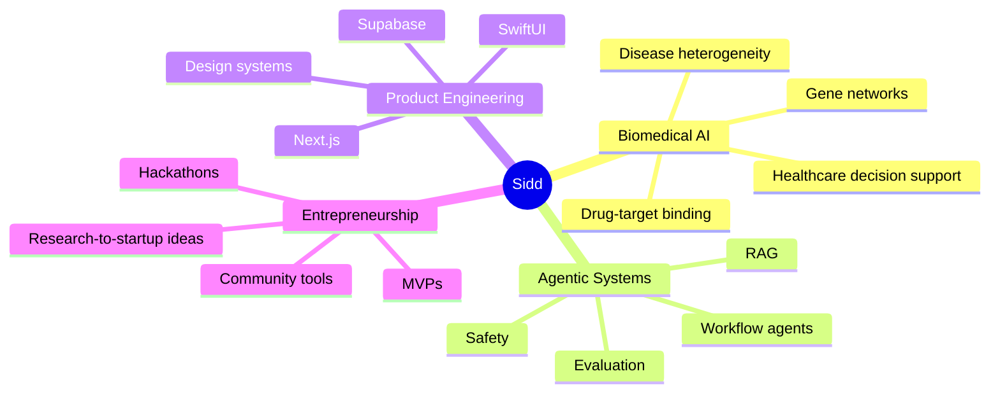

<p align="center">
  
</p>

<p align="center">
  
</p>

<p align="center">
  <a href="mailto:YOUR_EMAIL">
    
  </a>
  <a href="https://www.linkedin.com/in/siddharthareddyp//">
    
  </a>
  <a href="https://bio-theme-archive.vercel.app/">
    
  </a>
  <a href="https://github.com/siddu1324?tab=repositories">
    
  </a>
</p>

---

## hey, I'm Sidd 👋

I like building at the intersection of **AI, biomedical research, intelligent agents, and product design**.

Currently, I am an incoming **M.S. in Artificial Intelligence student at Columbia University**, focused on turning messy biological and healthcare data into clearer questions, better models, and useful tools. My work sits across **machine learning, genomics, drug-target modeling, healthcare AI, and agentic systems**.

```txt
research taste:   biomedical AI · gene networks · drug-target binding · health agents
builder taste:    full-stack apps · AI tools · polished UX · hackathon-speed MVPs
career direction: research engineer / AI builder / biomedical AI founder
```

---

## what I'm building toward

<table>
  <tr>
    <td width="33%">
      <h3 align="center">🧬 Biomedical AI</h3>
      <p align="center">ML for genomics, disease patterns, EGFR mutants, biological networks, and translational research.</p>
    </td>
    <td width="33%">
      <h3 align="center">🤖 Agentic Systems</h3>
      <p align="center">AI agents that triage information, coordinate workflows, and make expert work easier to act on.</p>
    </td>
    <td width="33%">
      <h3 align="center">🚀 Product Engineering</h3>
      <p align="center">Fast, polished full-stack systems with clean UX, reliable infra, and real-world deployment.</p>
    </td>
  </tr>
</table>

---

## tech I enjoy using

<p align="center">
  
</p>

<p align="center">
  
  
  
  
</p>

---

## featured work

| Project | What it shows | Stack / Focus |
|---|---|---|
| **VitalBridge** | Explainable patient triage + healthcare UX | Swift, SwiftUI, clinical reasoning, demo-mode MVP |
| **ReliefCopilot** | Offline crisis-response AI agent | RAG, emergency workflows, WHO/ICS-style guidance |
| **EGFR Binding Pipeline** | Drug-target binding modeling for EGFR mutants | Python, BindingDB, ConPLex, benchmarking |
| **CRC Gene-Network Research** | Heterogeneity-aware colorectal cancer pattern discovery | Bioinformatics, DUO networks, biomarkers |
| **AgentFlightCheck** | Safety/evaluation layer for MCP-style AI agents | Agent evals, risk scoring, certification thinking |
| **Full-Stack Builds** | Polished startup-style MVPs and community platforms | Next.js, Supabase, PostgreSQL, Tailwind |

---

## my research / builder map



---

## GitHub pulse

<p align="center">
  
  
</p>

<p align="center">
  
</p>

---

## contribution garden

<p align="center">
  <picture>
    <source media="(prefers-color-scheme: dark)" srcset="https://raw.githubusercontent.com/YOUR_GITHUB_USERNAME/siddu1324/output/github-contribution-grid-snake-dark.svg">
    <source media="(prefers-color-scheme: light)" srcset="https://raw.githubusercontent.com/YOUR_GITHUB_USERNAME/siddu1324/output/github-contribution-grid-snake.svg">
    
  </picture>
</p>

---

## current focus

```yaml
now:
  studying: "graduate-level AI, ML systems, biomedical AI"
  researching: "gene networks, drug-target binding, health AI, agentic workflows"
  building: "tools that make complex work easier to understand and act on"
  looking_for: "research, RA/TA, AI/ML, health-tech, and agentic systems opportunities"
```

---

## tiny philosophy

> Build systems that make intelligence useful, biology interpretable, and decisions clearer.

<p align="center">
  
</p>
